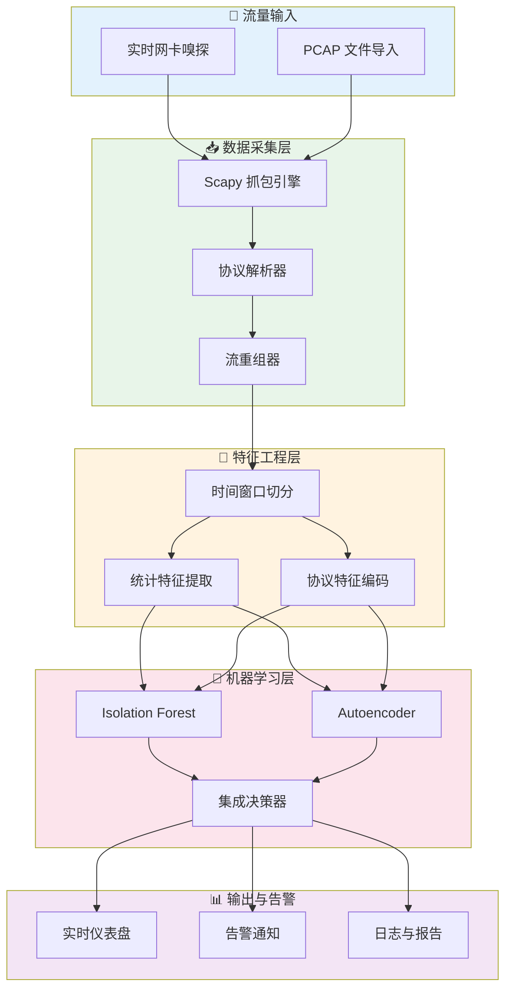

# 🛡️ PacketSentry — 网络哨兵

> 基于机器学习的网络流量异常检测系统

[](https://python.org)
[](https://docker.com)
[](LICENSE)

## 📖 项目简介

PacketSentry 是一款面向信息安全领域的智能网络流量异常检测系统，结合了**传统统计特征工程**与**无监督机器学习算法**，能够在无需标注数据的情况下，自动识别网络流量中的异常行为（如 DDoS 攻击、端口扫描、数据渗出等）。

### 核心特性

- 📡 **实时流量采集**：基于 Scapy 的数据包嗅探与解析，支持 PCAP 离线分析
- 🔬 **多维特征提取**：从原始流量中提取 30+ 维度统计特征（包速率、字节分布、协议比例等）
- 🤖 **无监督异常检测**：Isolation Forest + Autoencoder 双模型架构，无需攻击样本标注
- 📊 **可视化仪表盘**：实时流量趋势图、异常热力图、协议分布饼图
- 🐳 **一键容器部署**：Docker Compose 编排，5 分钟启动完整检测系统

## 🌟 背景意义

传统基于签名的入侵检测系统（如 Snort、Suricata）只能识别已知攻击模式，对零日攻击和高级持续性威胁（APT）无能为力。PacketSentry 采用机器学习方式，通过学习正常流量基线来检测偏差，具备以下优势：

1. **无需已知攻击签名**：基于统计异常检测，可发现未知攻击模式
2. **无监督学习**：不需要昂贵的标注数据，仅需正常流量即可训练
3. **双模型交叉验证**：Isolation Forest（快速粗筛）+ Autoencoder（深度细检），降低误报率
4. **实时与离线双模式**：既可实时监控网络，也可分析历史 PCAP 文件

## 🏗️ 系统架构



## 📁 项目结构

```
PacketSentry/
├── packetsentry/              # 核心包
│   ├── __init__.py
│   ├── __main__.py           # CLI 入口
│   ├── cli.py                # 命令行界面
│   ├── collector/            # 流量采集模块
│   │   ├── sniffer.py        # Scapy 嗅探引擎
│   │   ├── parser.py         # 协议解析器
│   │   └── flow.py           # 网络流重组
│   ├── features/             # 特征工程模块
│   │   ├── extractor.py      # 特征提取核心
│   │   ├── statistics.py     # 统计特征计算
│   │   └── encoder.py        # 特征编码与归一化
│   ├── models/               # 机器学习模型
│   │   ├── isolation_forest.py  # IF 检测器
│   │   ├── autoencoder.py    # 自编码器检测器
│   │   └── ensemble.py       # 集成决策器
│   ├── detector/             # 检测引擎
│   │   └── engine.py         # 检测调度核心
│   ├── utils/                # 工具函数
│   │   ├── config.py         # 配置管理
│   │   └── logger.py         # 日志模块
│   └── visualizer/           # 可视化模块
│       └── dashboard.py      # 终端仪表盘
├── tests/                    # 测试套件
├── examples/                 # 示例脚本
├── config/                   # 配置文件
├── Dockerfile                # 容器化部署
├── docker-compose.yml        # 编排配置
└── requirements.txt          # Python 依赖
```

## 🚀 快速开始

### 方式一：Docker 部署（推荐）

```bash
# 构建镜像
docker compose build

# 分析 PCAP 文件
docker compose run packetsentry analyze /data/capture.pcap

# 实时监控（需要 host 网络模式）
docker compose run --net=host packetsentry monitor -i eth0

# 训练模型
docker compose run packetsentry train /data/normal_traffic.pcap
```

### 方式二：本地安装

```bash
# 克隆仓库
git clone https://github.com/Kirishima-Mana/PacketSentry.git
cd PacketSentry

# 安装依赖
pip install -r requirements.txt

# 分析 PCAP 文件
python -m packetsentry analyze ./examples/sample.pcap

# 训练基线模型
python -m packetsentry train ./data/normal_traffic.pcap

# 实时监控
sudo python -m packetsentry monitor -i eth0
```

## 🔧 技术栈

| 组件 | 技术选型 | 说明 |
|------|---------|------|
| 语言 | Python 3.10+ | 核心开发语言 |
| 抓包 | Scapy | 数据包嗅探与协议解析 |
| 特征工程 | NumPy / Pandas | 统计计算与数据处理 |
| 机器学习 | scikit-learn + PyTorch | IF + Autoencoder 双模型 |
| 可视化 | Rich + Matplotlib | 终端仪表盘 + 图表输出 |
| CLI | Click | 命令行界面 |
| 容器化 | Docker + docker-compose | 一键部署 |
| 测试 | pytest | 单元测试 + 集成测试 |

## 📋 检测能力

| 异常类型 | 检测方法 | 特征依据 |
|---------|---------|---------|
| DDoS / DoS | IF + AE | 包速率突增、源 IP 聚集 |
| 端口扫描 | IF | 目标端口分散度、SYN 比例异常 |
| 数据渗出 | AE | 上行流量突增、大包比例异常 |
| 横向移动 | IF + AE | 内部主机间新连接激增 |
| 协议异常 | IF | 非标准协议比例、端口-协议不匹配 |
| C2 通信 | AE | 周期性心跳包、固定大小 DNS 查询 |

## 📊 提取特征列表

### 时间窗口统计特征（每 5 秒窗口）
- 包数量 / 字节数（上/下行）
- 包到达时间间隔统计（均值/方差/最大/最小）
- 唯一源/目标 IP 数
- 唯一目标端口数
- 协议分布比例（TCP/UDP/ICMP/Other）
- TCP 标志位分布（SYN/ACK/FIN/RST）
- 平均包大小 / 包大小标准差
- 流持续时间 / 流数量

## 📄 许可证

[MIT License](LICENSE)

---

> **PacketSentry** — 让每一字节流量都无所遁形 🛡️
